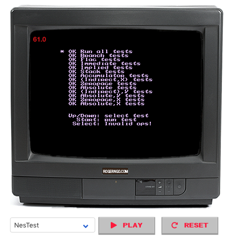

# NesThing

I wanted to just get better at TypeScript at first, but then I went down a rabbit hole and saw, experienced, and created something much more than I expected...

**A Nintendo Entertainment System and Famicom emulator written in TypeScript for web browsers.**


## Features and Status

This emulator is on-going development and is my main "passion project" when it comes to just implementing whatever I have learned with regards to web development, JS, etc. 

### Basic Features

* Fully playable through a web browser
* Keyboard and XBOX 360 control support. 
* NROM, MMC1, MMC3 and AOROM games supported.
* All playable through the latest versions of Chrome, "new" Microsoft Edge, and Firefox
* Save states as JSON files, and loadable once game has been loaded.
* Currently preloaded with several games.
  * Mario Bros.
  * Donkey Kong
  * Tetris
  * Super Mario Bros.
  * Super Mario Bros. 3
  * The Legend of Zelda
  * Final Fantasy
  * Mega Man
  * Mega Man 2
  * Silkworm
  * Teenage Mutant Ninja Turtles
  * Battletoads
* Svae state compression

### Future Enhancements

* Customizable control mapping
* MMC5, and Sunsoft mappers support
* Network play
* NES ROM file loading for faster delivery of emulator, rather than preloading ROM files as JSON
* Full debugging suite written in React


## Requirements

A computer, preferably something beefy. I started this project on a trusty **2014 13" Macbook Pro with a dual core Intel Core i7 4578U/16 GB RAM** and eventually upgraded to a **2019 13" Macbook Pro with a quad core Intel Core i7 8569U/16 GB RAM**.

For both systems, I was able to get around 60 fps just fine. My wife's Dell XPS 13 from 2018 was able to average 60fps NROM games, and dipping down to 20-30 fps for MMC3 games.


## Setup

Fairly easy, just clone the project

```
git clone https://github.com/urbanspr1nter/nesthing.git
```

Then navigate to the `./src/nes` directory and do:

```
npm install
```

Build with webpack and compile C code to WASM within the same directory:

```
npm run build
```

The distribution files are within `dist` and just open `./src/index.html` to demo.


## Live Demo

If you are too lazy to clone and build the project, feel free to check out the live demo here:


**NesThing - http://rogerngo.com/nesthing**


## Testing

```
npm run test
```

### nestest

* The CPU currently passes all `nestest` ROM tests. :)



## Feedback? Contact?

If you have any questions, feel free to submit a question through email, urbanspr1nter@gmail.com, or write a pull request, or somthing. :)


## Credits

This emulator could not have been created without being heavily based on [fogleman/nes](https://github.com/fogleman/nes), an NES emulator written in Go. 

Through lots of nights, I mainly used this emulator as a reference whenever I got stuck. I am deeply grateful for it to have been created.