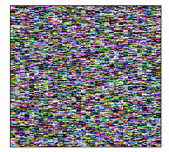

### HTML5 Canvas Rendering Performance

I have been working on optimizing the rendering performance of the rendering routine in outputting a frame buffer onto the screen to an HTML5 Canvas.

Throughout my development process, I have been familiarizing myself on what would be the best approach to render a **single pixel** onto the browser screen. 

In this discussion, I will communicate some of the challenges I encountered while attempting to write a fast rendering routine for a `256x240` frame of RGB pixels onto an HTML5 Canvas. 

Trust me, it is harder than you think. ;)

#### The Problem

Suppose we have a `256x240` (width x height) graphic that looks like this: 



In total, there are *64 displayable colors* here in this frame. 

We will pretend for a moment that this is a representation of a screen for some device such as the **Nintendo Entertainment System** (although not technically precise). Knowing that the resolution of this screen is 256x240, we can work out the math that there are 61,440 pixels which should be rendered onto the canvas. 

Let us now use our imagination further and say that we actually have to render this entire frame pixel-by-pixel. 

To make things even more fun, let's avoid using the array representing the image data itself provided by the HTML5 Canvas. We will not draw the pixels straight onto the image data with the RGB values. Although, I would personally like to conduct this experiment another time. :)

What's the best way to do it on HTM5 canvas? Well, there are two ways we can do this aside from using the typed array and drawing the pixels using straight RGB integer values.

1. Rendering pixel-by-pixel by drawing a line of length 1.
2. Rendering pixel-by-pixel by drawing a rectangle and filling it with the color with area 1. (1x1).

#### The Experiment

Six (6) different experiments were conducted:

1. Using `moveTo` and `lineTo` to draw a line of length 1 to simulate a single pixel.
2. Using `moveTo` and `lineTo` draw a single pixel in addition to using a "cache" to only redraw changed elements on screen.
3. Using `moveTo` and `lineTo`, a cache and double buffering to draw the pixels first offscreen and then to an onscreen canvas.
4. Using `fillRect` to draw a rectangle of area `1x1` and filling it with the appropriate color.
5. Using `fillRect` in addition to using a cache to only redraw changed pixels on screen.
6. Using `fillRect`, a cache, and double buffering the rendering of the pixels onto an off-screen canvas before outputting onto the screen.

For the experiment, I have chosen to randomize the pixel colors, but repeat the same exact previous pixel from the previous frame if, and only if the current pixel is a multiple of 3. This is done to show the benefits of using a cache for experiments (2), (3), (5) and (6).

You can run the experiment yourself here within this source repo in [experiments/canvas-rendering](../experiments/canvas-rendering), or online at http://rogerngo.com/demo/experiements/canvas-rendering/index.html.


#### Drawing a Pixel Using a Line.

The typical routine here is to perform the following for every pixel:

```
    context.strokeStyle = currFrame[i][j];

    context.beginPath();
    context.moveTo(j, i);
    context.lineTo(j + 1, i + 1);
    context.stroke();
    context.closePath();
```

Here, we are setting the pen color, or `strokeStyle` to be the current color defined by the frame buffer and then starting a path, moving the pen to the desired location, and finally drawing a line of length 1.

We can then also take it a step further and use a cache that stores all the current colors which the canvas currently has using a 2D array of strings. Each value is just the hex-color string.

```
    if (pixelCache[i][j] && pixelCache[i][j] === currFrame[i][j]) {
        continue;
    }

    pixelCache[i][j] = currFrame[i][j];
    context.strokeStyle = pixelCache[i][j];

    context.beginPath();
    context.moveTo(j, i);
    context.lineTo(j + 1, i + 1);
    context.stroke();
    context.closePath();
```

With the above, we simply just don't render if the current color in the frame buffer has not changed.

And finally, we can take it a step further and define an offscreen canvas to draw on and finally place the completed image onto the onscreen canvas.

```
    const backCanvas = document.createElement("canvas");
    backCanvas.width = STD_WIDTH;
    backCanvas.height = STD_HEIGHT;

    const backContext = backCanvas.getContext("2d");

    ...

        if (pixelCache[i][j] === currFrame[i][j]) {
            continue;
        }

        pixelCache[i][j] = currFrame[i][j];
        backContext.strokeStyle = pixelCache[i][j];

        backContext.beginPath();
        backContext.moveTo(j, i);
        backContext.lineTo(j + 1, i + 1);
        backContext.stroke();
        backContext.closePath();

    ...

    context.drawImage(backCanvas, 0, 0);
```

#### Drawing a Pixel Using a Rectangle

Drawing a rectangle requires less lines of code. We simply need to set the `fillStyle` to be the current color defined by the frame buffer, and then fill a 1x1 rectangle at the desired location.

The rationale here is that setting `fillStyle` and then calling `fillRect` is very expensive. We just want to see here how **expensive** that can actually be. 

```
    context.fillStyle = currFrame[i][j];
    context.fillRect(j, i, 1, 1);
```

As with the previous `moveTo/lineTo` test with caching, we can apply the same techniques with our `fillRect` test to only redraw pixels which have changed:

```
    if (pixelCache[i][j] && pixelCache[i][j] === currFrame[i][j]) {
        continue;
    }

    pixelCache[i][j] = currFrame[i][j];
    context.fillStyle = pixelCache[i][j];
    context.fillRect(j, i, 1, 1);
```

And finally, we can take it a step further and define an offscreen canvas to draw on and finally place the complete image onto the onscreen canvas.

```
    const backCanvas = document.createElement("canvas");
    backCanvas.width = STD_WIDTH;
    backCanvas.height = STD_HEIGHT;

    const backContext = backCanvas.getContext("2d");
    

    ...

        if (pixelCache[i][j] === currFrame[i][j]) {
            continue;
        }

        pixelCache[i][j] = currFrame[i][j];
        backContext.fillStyle = pixelCache[i][j];
        backContext.fillRect(j, i, 1, 1);

    ...

    context.drawImage(backCanvas, 0, 0);
```

#### Setup

The experiments were conducted on a **2014 Macbook Pro** with the following system configuration:

* 2 core 3.0 GHz CPU - Core i7 4578U 
* 16 GB DDR3 RAM
* Mac OS X 10.14.5
* Google Chrome 74.0.3729

#### Results

The tests were run for 120 frames, and the time was measured using `performance.now()`. Units are in milliseconds.

### 256x240 Results
|Test Name|Description|Time|Baseline Performance|Performance From Previous|
|---------|----|----------|--------------------|-------------------------|
|1|moveTo/lineTo|16,249.565 ms|1.00x|0x|
|2|moveTo/lineTo + cache|2,663.530 ms|6.10x (1)|6.10x (1)|
|3|moveTo/lineTo + cache + double buffer|2,639.625 ms|6.15x (1)|1.01x (2)|
|4|fillRect|8,740.410 ms|1.86x (1)|1.86x (1)|
|5|fillRect + cache|2,113.770 ms|7.69x (1)|4.13x (4)|
|6|fillRect + cache + double buffer|2,144.525 ms|7.58x (1)|0.99x (5)|

#### Analysis 

##### moveTo/lineTo

Based on the results, drawing a line is **much** slower than drawing a rectangle to simulate a single pixel. The suspicion here is that setting the stroke style, then moving the pen to the desired location can take a lot of time. 

##### moveTo/lineTo + cache

Redrawing the line only when the pixel has changed really makes a difference! Implementing this alone gives 6.10x performance improvement.

The fact that it is quite easy to just implement such a check to only redraw changed pixels makes this option even more enticing for anyone who is looking for an "easy" performance tweak.

##### moveTo/lineTo + cache + double buffering

Double buffering didn't really seem to improve the performance that much. Only about 1%, or 1.01x from just caching. I suspect that it is because the image may just be too small for the CPU to have much trouble redrawing the canvas. 

##### fillRect

Drawing a rectangle is much faster. About 86% faster than drawing lines as pixels! Wow, that's almost "twice as fast". 

Therefore if we're going to try to draw a single pixel, we should definitely consider doing it through `fillRect`. 

##### fillRect + cache

Can we go faster? Certainly! 

With this test, applying caching techniques to only re-draw the changed pixels produced a result which I consider to be "as expected". 

Since the `moveTo/lineTo + cache` test gave over a 6x performance improvement, the expectation was that the `fillRect + cache` test would give a similar result. Here, it was 4.13x from `fillRect`, but most interesting is that from the original `moveTo/lineTo` algorithm, `fillRect + cache` gives a 7.69x increase. 

##### fillRect + cache + double buffering

Now, the last one here is double buffering on top of `fillRect` and caching. We see here that there is not much of a performance difference. If anything, this is slower than just `fillRect + cache`. 

Just like the `moveTo/lineTo + cache + double-buffer` test, we didn't see much of a performance benefit with double buffering. 

I had mentioned before that it may be due to the image being too small to see any substantial benefit of double buffering.

But how about if we increase the size of the canvas to 1024x1024? What are the results here?

### 1024x1024 Results
|Test Name|Description|Time|Baseline Performance|Performance From Previous|
|---------|----|----------|--------------------|-------------------------|
|1|moveTo/lineTo|372,482.019 ms|1.00|0x|
|2|moveTo/lineTo + cache|54,968.509 ms|6.78x (1)|6.78x (1)|
|3|moveTo/lineTo + cache + double buffer|52,574.840 ms|7.09x (1)|1.05x (2)|
|4|fillRect|204,692.265 ms|1.82x (1)|1.82x (1)|
|5|fillRect + cache|32,832.600 ms|11.35x (1)|6.23x (4)|
|6|fillRect + cache + double buffer|30,054.010 ms|12.39x (1)|1.09x (5)|

Pretty interesting. We see that the larger the frame is, the more pixels we have the render, the better the performance is. The performance gaps between each optimization literally widens. 

Double buffering here then becomes a good optimization as now there is a 5% performance increase using double buffering for line drawing, and 9% performance increase for rectangles.

The more pixels we need to draw on screen, the more benefits some of these optimizations become. 

We observe over 12x performance gain from `fillRect + cache + double buffer` from the original `moveTo/lineTo` drawing routine. 

#### Other Optimizations

Can we do anything else to optimize each of the drawing routines? Well, yes. I actually had not considered line drawing algorithms, or even drawing the pixel directly onto image data.

This is something worth exploring, but for my purposes, applying the techniques to use `fillRect` and redraw only changed pixels in experiment (5) was more than fast for me. 

I only needed to draw a `256x240` frame. Additionally, with my use case, the pixels don't exhibit much change from frame to frame. Therefore, for my specific use case I have actually been able to get rendering down to **1 ms** per frame just using the techniques covered in (5). 

When canvas optimizations give the rendering time you are satisfied with, optimizations aren't done just yet. Your performance concerns then move onto computation as the bottleneck. The computation comes from the generation of the pixels within the frame buffer. 

Optimizing this computation is the next step to performance rather than unnecessarily optimizing rendering performance which has gone beyond 60 fps. (Think: Knuth's saying of pre-optimization)