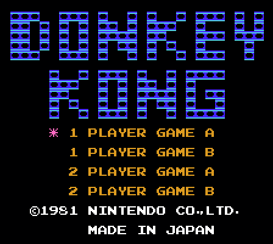
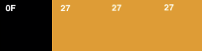
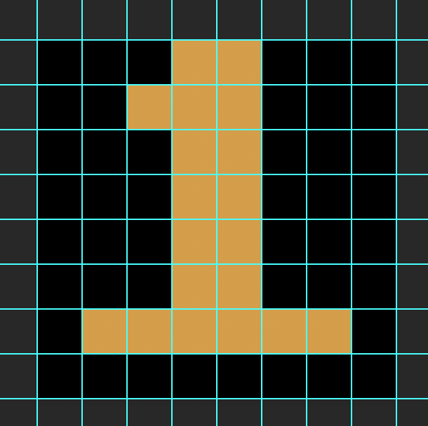

# NES PPU

## Hardware Emulation Approach 

Probably one of the more difficult things when writing an NES emulator from my experience so far is just knowing where to begin when it comes to implementing the PPU. 

After a while, running `nestest.nes` a few times, you will some sense of some security in that your emulated 2A03 CPU is "good enough". Another thing is that you will need something new to show off!  

Now it's time to implement the PPU (Picture Processing Unit)! Where do we begin? This document aims to give the programmer a "first start" when it comes to writing basic NES PPU emulation. 

At this current time, `NesThing` doesn't really have a full-featured PPU -- yet. However, *Mario Bros.* and *Donkey Kong* are somewhat playable, so the document aims to explain the PPU in this context. 

The following discussion aims to give the reader an approach to achieve the same thing with their own implementation. 

I should also warn that everything that will be discussed in this document is in the context of **NTSC video**. However, most of the information is applicable to PAL too. I suppose that it's just the *exact* numbers will be slightly different, but if you're familiar with video, you will know what to look out for: refresh rates, timings, etc. These are all easily referenced elsewhere.

## The Facts

The system architecture of the NES is not **von Neumann**. In other words, it is **not** a system architecture that is designed for components to work serially, where all input is given to the CPU, and the CPU works to give output to some other device. The basic diagram from this [article](https://en.wikipedia.org/wiki/Von_Neumann_architecture) is shown below:


Notice that the central processing unit is literally the **central** processing unit. All input data from I/O devices is passed through some bus where the CPU receives this information, and processes this information for output.

To give a very dumbed-down example, think of the von Neumann architecture in the perspective of a desktop computer. With input data being passed through to the CPU, this means that a key stroke from the keyboard would be registered as a binary stream of data from a controller to the CPU. The CPU is then responsible for interpreting this data and then outputting it onto another component in the system, such as a monitor. 

Since the NES is not a von Neumann machine, and the CPU and PPU do not execute serially. These two components then execute in parallel. To make matters more interesting, the CPU and PPU share the same data bus. In effect, these components can interfere with each other through corruption of data depending on how programs (games) are written.

To the beginner emulator author such as myself, I have found that understanding the pattern on how the CPU and PPU execute alongside one another, is not immediately obvious. Personally, I was used to the von Neumann style architecture of execution, and could not accept the fact that the CPU and PPU were independent and must cooperate with each other through the use of various registers and flags found within them.

## Emulating Execution

The typical execution loop of our emulator, in pseudo code is probably similar to this:

```
while (true) {
    cpu.step();
}
```

Where `step` executes a single CPU instruction.

We need to figure out where, and when we can execute the PPU during this emulation cycle. Again, the components aren't executed serially, but we can emulate parallel execution through stepping through each cycle and executing the number of appropriate cycles to stay synchronized.

The PPU executes 3 PPU cycles per 1 CPU cycle as it is clocked 3 times faster than the CPU. Therefore, an approach to synchronize the PPU to the CPU is to execute the exact number of PPU cycles based off of the CPU cycles:

```
while (true) {
    var cpuCycles = cpu.step();

    var ppuCycles = 3 * cpuCycles;

    for (let i = 0; i < ppuCycles; i++) {
        ppu.step();
    }
}
```

Since the NES CPU and PPU execute at the same time in real-life, we will compensate by emulating this parallel execution through explotation of the fact that modern computers are generally very fast.

We can execute the CPU and PPU separately, in the smallest possible time periods we can manage. We can define a "small time period" as a single CPU instruction. 

This approach relies on the CPU to be the "master" of the system and have the PPU be emulated to execute at the same time as the CPU by synchronizing the number of cycles exceuted by the CPU by 3 times. 

Since your desktop computer runs very fast, doing this frequently will create the illusion of parallel execution.

The approach I have described here is called *catch-up*. A good resource is to read up on emulator catch up from **NesDev**. See the discussion on [emulator catchup](https://wiki.nesdev.com/w/index.php/Catch-up).

One temptation for an approach to emulate the CPU and PPU executing with each other is to write a multi-threaded emulator where the CPU and PPU are executed in 2 different threads at once, and access each other through calls. This is very complicated, and generally not a recommend approach at all. 

## Synchronizing Execution

The CPU runs at a clock rate of 1.79 MHz. Since the PPU runs 3x the number of cycles the CPU runs for every instruction, the hardware PPU can be calculated to have a clock rate of about 5.37 MHz. All these clock speeds are derived by a main clock with the CPU and PPU clock values being some quotient value of it.

In the case of the NES, the main clock is `21.4772 MHz` with the CPU clock being `21.4772/12` (divider is 12) and PPU being `21.4772/4` (divider is 4).

In our implementation, we will execute 3 PPU cycles for every CPU cycle. For every instruction, where the number of cycles it had taken the emulated CPU core to execute, we can define it by `cpuCycles`. The PPU cycles then can be found by multiplying this number by 3 -- which can be represented as: `ppuCycles = 3 * cpuCycles`.

As shown previously, our emulated catch-up routine looks like this:

```
while (true) {
    var cpuCycles = cpu.step();

    var ppuCycles = 3 * cpuCycles;

    for (let i = 0; i < ppuCycles; i++) {
        ppu.step();
    }
}
```

Now, it is great that we can emulate both the CPU and PPU "at the same time", but now we need to dive into the discussion on what we can do to have these emulated components communicate with each other.

Now, I think this is the perfect moment to discuss the internal registers which the PPU exposes to the CPU.

## Memory-Mapped I/O

As discussed previously, the CPU, PPU and discussed later, APU, all share the same data bus. The CPU makes a request to some address in memory for I/O, and the controller is reads the address to see where the data byte hould be pulled from: RAM, hardware register, etc. All data bytes flow through the same bus.

Because of this, the CPU and PPU aren't directly connected to each other, per se, but rather connected to the common data bus where the data is manipulated by memory address reads and writes.


## Interfacing Between the CPU and PPU

Internally, the PPU has several hardware registers:

`v` the VRAM register which is 14 bits wide.
`t` the temporary VRAM register which is also 14 bits wide.
`x` the fine x scroll register;
`w` the second write toggle

Since the CPU cannot interact with these registers within the PPU directly, they are exposed through memory-mapped I/O. CPU addresses `$2000` to `$2007` are wired to interface with the PPU registers. Additionally, the address `$4014` is also used by the PPU to perform DMA transfer to memory.

To review, the memory layout of the NES is:

|Address|Purpose|Width|
|-------|-------|-----|
|0000-07FF|2 KB RAM|2048 B|
|0800-0FFF|Mirrors of RAM (0000-07FF)||
|1000-17FF|Mirrors of RAM (0000-07FF)||
|1800-1FFF|Mirrors of RAM (0000-07FF)||
|**2000-2007**|**PPU Registers via MMIO**|**8 B**|
|2008-3FFF|Mirrors of PPU Registers||
|4000-4017|APU and I/O Registers|24 B|
|4018-401F|APU and I/O Functionality that is normally disabled|8 B|
|4020-FFFF|Mapped to Cartridge PRG ROM, PRG RAM, etc.|49120 B|

An example of this is writing to PPU memory. This requires manipulation of the `v` register to set the proper VRAM address needed to place the data into the data bus to the PPU  memory. This gives a total of 8 bytes, or 8 mapped registers for the CPU to communicate with the PPU.

The misconception is that reading/writing data to the memory-mapped I/O addresses serves as some sort of asynchronous request that occurs from the CPU to the appropriate hardware device, where for example, the mental model of execution may result in something like this:

```
1. Game writes a byte to $2006: $20
2. CPU receives the request, sees $2006, and forwards to PPU.
3. Game writes a byte to $2006: $BF
4. CPU receives the request, sees $2006, and forwards to PPU.
```

This is not entirely true. How memory-mapped IO registers should be more appropriate thought of is that the PPU should be intercepting the bytes flowing through the data bus whenever the associated addresses are touched, and should be handled immediately:

```
1. Game writes a byte to $2006: $20
2. PPU monitoring the address bus sees $2006. 
    -> PPU knows that the data byte $20 is for it.
    -> Handle the byte as the high byte of a VRAM address.
3. Game writes a byte to $2006: $BF
    -> PPU knows that the data byte $BF is for it.
    -> Handle the byte as the low byte of a VRAM address.

(VRAM address is now $20BF)
```

It is then important to keep in mind that CPU reads and writes to the addresses `$2000 - $2007`, and `$4014` in its address space are simply forwarded to the PPU hardware registers and are reflected immediately within the PPU hardware registers. 

Suppose then we want to implement register writes to the VRAM address for the PPU. Then, we can simulate this interfacing between the CPU and PPU through a `Memory` controller object. 

```
class Memory {
    read(address) {
        var cleanAddress = address & 0xffff;

        ... read the data here.


        return result;
    }

    write(address, value) {
        var cleanAddress = address & 0xffff;
        var cleanValue = value & 0xff;

        if(cleanAddress < 0x800) {
            // write to RAM
        } else if(cleanAddress ... ) {
            ....
        } else if(cleanAddress === 0x2006) {
            this.ppu.write$2006(cleanValue);
        } else {
            ....
        }
    }
}
```

Within the `write` method, we can directly forward all writes to memory address `$2006` to the internal PPU object which has the method to write VRAM addresses.

This approach is an easy way to simulate easy interfacing for register reads, and writes to the PPU.

## Colors and Palette


The NES PPU can output a total of 64 colors in its color space. Really, only 52 color are "unique". These colors are actually more of a **CLUT** (color lookup table), and the RGB values have already been predefined. 

It is then fair to claim and assume that each value such as `$2C` read from memory when dealing with colors refers to the light-blue color as seen in the palette shown above. Or more precisely: `rgb(62, 194, 205)`, or:


Since we are dealing with writing an emulator, let's start referring to "dots" as "pixels" to be rendered. Ultimately the end goal of implementing the PPU is to output an image rendered on screen on what the real PPU would output onto the television.

Just because there are 64 colors to choose from to represent an image does not mean they can all be used at once. As an even bigger restriction, the number of active colors on screen could only be 16. This limitation may have lead to creative art during the later titles released on the NES as the limited color palette was being maximized.

If the number of simultaneous colors on screen can only be 16, this means that we only need 4 bits to represent a pixel. The possible values which can be represented by 4 bits is then a value anywhere from: 0-15. 

Each bit of the 4-bit pixel color respresents something. The 2 most significant bits represent the **attribute** bits, which help dictate what 4-color palette to use. The 2 lease significant bits represent the combination of high and low tile bits from the group of 16 bytes which have been referenced by the nametable byte.

```
AAHL
```

> `AA` are the 2 bits which represents the specific palette index of which palette the colors will be coming from.
> 
> `HL` represents the 2 bits which given the palette, the offset from the specific palette address to add to the base palette address which will then contain the byte of the color

The memory layout of the background palettes is as follows:

|Address|Palette Index|
|-------|-------------|
|$3F00|Universal background color|
|$3F01|0|
|$3F05|1|
|$3F09|2|
|$3F0D|3|

Suppose then our memory map is as follows:

```
$3F00: $0F
$3F01: $2C
$3F02: $38
$3F03: $12
$3F04: $0F
$3F05: $27
...
$3F08: $27
```

A 4 bit string representing a single can be: `0010` which translates to hex value `$2`. Dissecting this, we can see that `AA = 00` which then gives us a `basePaletteAddress = $3F01`. The index, which is zero based can be calculated by taking the lower order 2 bits where `HL = 10`: `colorOffset = $10 - $01 = $01`. We then compute the `effectiveAddress` of the color byte as follows:

```
const effectiveAddress = basePaletteAddress + colorOffset;

= $3F01 + $1 = $3F02
```

Looking at memory, we find that `$3F02` gives us the color `$38` which going back to our color palette gives us: `rgb(228, 220, 168)`, or:


Now, let's take a look at how we can even obtain the values of the bits to build our 4-bit `AAHL` string.

## Background Tile Rendering

Since we know that a single color is a string of 4 bits, `AAHL`, you may expect that we need 3 different pieces of information: attribute bits, high bits and low bits of the background tile. In fact, we need 4!

The next few sections introduce some terminology which will hopefully clarify a lot of the ambiguity when it comes to getting your first frame rendered with background tiles.

## Nametable

As briefly mentioned earlier, each background tile is made up of a high byte, and a low byte for pixel content. A tile is `8x8` pixels, and each within this 8x8 grid, is represented by a high tile byte, and a low tile byte -- giving a total of 16 bytes to represent a background tile.

This string of 16 bytes can be found in the location of the CHR-ROM in memory. However, the NES does not draw these 16 bytes directly to represent a background tile. That would be completely wasteful.

Instead, the NES keeps a single copy of these background tiles, and ultimately references them within a nametable. A `nametable` is a chunk in memory intended to represent the current frame of background tiles which the NES is currently rendering.

Each byte in the nametable is intended to represent a background tile. Since the NES resolution is `256x240`, we can compute the tile resolution of the nametable like so:

```
ResolutionWidth = 256
TileWidth = 8

TilesPerRow = 256 / 8
= 32

ResolutionHeight = 240
TileHeight = 8

TilesPerColumn = 240 / 8
= 30
```

The nametable is essentially a representation of 32x30 tiles, where each tile is composed of 8x8 pixels. Each nametable byte then references a sepcific address to the 16 byte chunk of the background tile.

The base nametable address, or the starting address where all the background tiles are stored in memory is controlled through the PPU register `$2000`. Background patterns are referenced starting at `$0000`, or `$1000`, depending on what bit is set within `$2000`.

The NES not only has 1 nametable, but 4 nametables with only 2 being active at a time to facilitate scrolling. This means that a total of 2 KB is reserved for nametables. Each nametable is 960 bytes each whith some space allocated for attribute memory for each background tile (which is an additional 64 bytes). Therefore, each nametable is composed of 1024 bytes, or 1 KB.

 The nametables start at addresses `$2000`, `$2400`, `$2800`, and `$2C00`. We will only discuss in the context of a single nametable for this document. Let's assume `$2000`, and the memory map of a nametable as follows:

|Address|Purpose|Size|
|-------|-------|----|
|`$2000 - $23BF`|Background tile data|960 B|
|`$23C0 - $23FF`|Attribute bytes|64 B|

To reiterate once more, nametable bytes are used as an index into the real set of background tile data found elsewhere in PPU memory starting at `$0000`, or `$1000`. We will now move onto discussing how that works.

## Background Pattern Tiles

Where background tiles are stored is called the pattern table.

As mentioned before, to calculate where the background tiles to fetch, we can take the `nametableAddress` along with the `backgroundTileBaseAddress` and compute the location on where to begin fetching the pattern tiles:

```
const lowBgTile = backgroundTileBaseAddress + ($10 * getByte(nametableAddress)) + fineY;

const highBgTile = backgroundTileBaseAddress + ($10 * getByte(nametableAddress)) + fineY + 8;
```

We will discuss `fineY` soon but notice the `+8` when computing the `highBgTile`. A single background pattern is composed of 16 bytes. 8 bytes serve as a low bit of a 2 bit color index offset. 

## Attribute Byte

A palette can only be 4 colors. There are multiple palettes associated with a particular background tile. In order for the NES to choose which palette to use, the attribute byte is utilized to select the palette at where to begin choosing colors. 

The attribute bytes for the particular nametable can be found within the last 64 bytes of the 1024 byte nametable. 

## Nametable Byte

The nametable consists of entries which *point* to set of bytes which compose the current 8x8 pixel. The nametable byte respresents this 8x8 pixel in the current tile. 

Therefore it is better to imagine the nametable as an index to the real pattern data found elsewhere within the background pattern address starting at `$0000`, or `$1000`. 

## Tile Low and High Bytes

Since a tile is represented as an 8x8 set of pixels, this gives 8 rows of 8 pixels. Each background tile is a set of 16 bytes, with 8 representing the low order bits of the 4-bit color, while the last set of 8 bytes represent the high order bits of the 4-bit color of that pixel.

Therefore, each row is composed of 2 bytes to form the 8 pixel row. 

## Example

Now, let's put together all the terminology we have learned so far, and see how the NES PPU renders out a background tile. The Donkey Kong title screen is a good example to start with for explaining this.



Let's take a look at how the "1" background tile is rendered by the PPU. The pattern looks like this:


When the title screen loads, the entire contents of the name table looks like:

```
24 24 24 24 24 24 24 24 24 24 24 24 24 24 24 24 24 24 24 24 24 24 24 24 24 24 24 24 24 24 24 24 

24 24 24 24 24 24 24 24 24 24 24 24 24 24 24 24 24 24 24 24 24 24 24 24 24 24 24 24 24 24 24 24 

24 24 24 24 24 24 24 24 24 24 24 24 24 24 24 24 24 24 24 24 24 24 24 24 24 24 24 24 24 24 24 24 

24 24 24 24 24 24 24 24 24 24 24 24 24 24 24 24 24 24 24 24 24 24 24 24 24 24 24 24 24 24 24 24 
24 24 24 62 62 62 24 24 62 62 62 24 62 24 24 62 24 62 24 24 62 24 62 62 62 24 62 24 62 24 24 24 
24 24 24 62 62 24 62 24 62 24 62 24 62 62 24 62 24 62 62 62 24 24 62 24 24 24 62 24 62 24 24 24 
24 24 24 62 62 24 62 24 62 24 62 24 62 62 62 62 24 62 62 24 24 24 62 62 62 24 62 62 62 24 24 24 
24 24 24 62 62 24 62 24 62 24 62 24 62 24 62 62 24 62 24 62 24 24 62 24 24 24 24 62 24 24 24 24 
24 24 24 62 62 62 24 24 62 62 62 24 62 24 24 62 24 62 24 24 62 24 62 62 62 24 24 62 24 24 24 24 
24 24 24 24 24 24 24 24 24 24 24 24 24 24 24 24 24 24 24 24 24 24 24 24 24 24 24 24 24 24 24 24 
24 24 24 24 24 24 24 62 24 24 62 24 62 62 62 24 62 24 24 62 24 62 62 62 62 24 24 24 24 24 24 24 
24 24 24 24 24 24 24 62 62 62 24 24 62 24 62 24 62 62 24 62 24 62 24 24 24 24 24 24 24 24 24 24 
24 24 24 24 24 24 24 62 62 24 24 24 62 24 62 24 62 62 62 62 24 62 24 62 62 24 24 24 24 24 24 24 
24 24 24 24 24 24 24 62 24 62 24 24 62 24 62 24 62 24 62 62 24 62 24 24 62 24 24 24 24 24 24 24 
24 24 24 24 24 24 24 62 24 24 62 24 62 62 62 24 62 24 24 62 24 62 62 62 62 24 24 24 24 24 24 24 
24 24 24 24 24 24 24 24 24 24 24 24 24 24 24 24 24 24 24 24 24 24 24 24 24 24 24 24 24 24 24 24 
24 24 24 24 24 24 24 24 24 01 24 19 15 0A 22 0E 1B 24 10 0A 16 0E 24 0A 24 24 24 24 24 24 24 24 
24 24 24 24 24 24 24 24 24 24 24 24 24 24 24 24 24 24 24 24 24 24 24 24 24 24 24 24 24 24 24 24 
24 24 24 24 24 24 24 24 24 01 24 19 15 0A 22 0E 1B 24 10 0A 16 0E 24 0B 24 24 24 24 24 24 24 24 
24 24 24 24 24 24 24 24 24 24 24 24 24 24 24 24 24 24 24 24 24 24 24 24 24 24 24 24 24 24 24 24 
24 24 24 24 24 24 24 24 24 02 24 19 15 0A 22 0E 1B 24 10 0A 16 0E 24 0A 24 24 24 24 24 24 24 24 
24 24 24 24 24 24 24 24 24 24 24 24 24 24 24 24 24 24 24 24 24 24 24 24 24 24 24 24 24 24 24 24 
24 24 24 24 24 24 24 24 24 02 24 19 15 0A 22 0E 1B 24 10 0A 16 0E 24 0B 24 24 24 24 24 24 24 24 
24 24 24 24 24 24 24 24 24 24 24 24 24 24 24 24 24 24 24 24 24 24 24 24 24 24 24 24 24 24 24 24 
24 24 24 24 24 D3 01 09 08 01 24 17 12 17 1D 0E 17 0D 18 24 0C 18 65 15 1D 0D 64 24 24 24 24 24 
24 24 24 24 24 24 24 24 24 24 24 24 24 24 24 24 24 24 24 24 24 24 24 24 24 24 24 24 24 24 24 24 
24 24 24 24 24 24 24 24 24 24 24 16 0A 0D 0E 24 12 17 24 13 0A 19 0A 17 24 24 24 24 24 24 24 24 
24 24 24 24 24 24 24 24 24 24 24 24 24 24 24 24 24 24 24 24 24 24 24 24 24 24 24 24 24 24 24 24 
24 24 24 24 24 24 24 24 24 24 24 24 24 24 24 24 24 24 24 24 24 24 24 24 24 24 24 24 24 24 24 24 
24 24 24 24 24 24 24 24 24 24 24 24 24 24 24 24 24 24 24 24 24 24 24 24 24 24 24 24 24 24 24 24
```

This entire table is 32x30 entries long, with the starting address at `$2000`, and the very last element at `$23BF`. You can make some quick deductions here. The first deduction is that `$24` correponds to some blank tile that represents the black background. You may also notice that if you stand far away, you can see the general pattern of the title screen. Here, you can then assume that `$62` is probably the pattern that composes the `DONKEY KONG` title on the title screen.

We are interested in finding out what pattern makes up `1`. The location we are looking at in the name table is then at address `$2209`. Let's express it like this:

```
Nt[0x2209] = 0x1
```

Now, that we have the name table byte, we need to find the group of 16 bytes within memory which composes the entire pattern. In order to do so, we must first find `baseNtAddress`. This is found through the use of inspecting the PPU register `$2000` to see which base name table address we should use. 

```
cpuMemory[0x2000] = 0b10010000
```

To refresh, the fifth least significant bit (the fifth bit from the right) represents the background pattern base address. If 0, then the base address starts at `$0`. If 1, then `$1000`. Here in this case, this bit is switched to 1, so then the base name table address begins at `$1000`.

```
BaseNtAddress = 0x1000
```

To calculate the background pattern address, we can now apply the following expression:

```
patternAddress = baseNtAddress + (0x10 * ntByte) + fineY
               = 0x1000 + (0x10 * 0x1) + 0
               = 0x1010
```

We now conclude that the pixels which make up the 8x8 pattern tile begins at address `$1010`. Inspecting the RAM, we can see that this 16 byte grouping is: 

```
18 38 18 18 18 18 7E 00
00 00 00 00 00 00 00 00
```

If we work this out by hand, and convert each value to binary, we can actaully start to see the 1 be formed:

```
00011000
00111000
00011000
00011000
00011000
00011000
01111110
00000000

00000000
00000000
00000000
00000000
00000000
00000000
00000000
00000000
```

Now, we must merge the tile low and tile high bytes together to have each pixel be within the value ranges of 0-3 as they are the color offsets for a specific palette chosen by the attribute byte. 

Now, merging these bits together:

```
00 00 00 01 01 00 00 00
00 00 01 01 01 00 00 00
00 00 00 01 01 00 00 00
00 00 00 01 01 00 00 00
00 00 00 01 01 00 00 00
00 00 00 01 01 00 00 00
00 01 01 01 01 01 01 00
00 00 00 00 00 00 00 00
```

Which outputs the values:

```
00011000
00111000
00011000
00011000
00011000
00011000
01111110
00000000
```

Here, we can clearly see the "1" that has been formed. Each individual value at a specific bit location in the low and high merged value corresponds to the color index at a specific palette.

Therefore that is why it is important to know the attribute byte which corresponds to this background tile in order to pick the paltte, and then the specific color offset from this palette (colors 0, 1, 2, or 3) based on this merged result.

In this case, we know that the pixels forming the `1` uses the second color (1) of its palette to form the character, while the first color (0) of its palette is used as the background color.

So we know the index of the color for the specific color palette to use, how do we find the color palette to select the color to begin with? This is where calculating the attribute byte for this specific tile at the location will allow us to determine just that!

If a name table is 1024 bytes long, you may have done some math to find out that 32x30 tiles is actually 960 bytes. So then, where are the remaining 64 bytes of the name table? What are they used for? 

The last 64 bytes of a name table is allocated to the *attribute table*. In the context of the first name table of the NES, the attribute table starts at address `$23C0`. Each byte of the attribute table corresponds to 4 groups of tiles. That means, 2 bits a group of tiles. 

The arrangement of the 2 attribute bits for each tile within the attribute byte is deliberate. Each attribute group is composed of 8, 8x8 tiles:

```
|-----|-----|
| 0-1 | 2-3 |
|-----|-----|
| 4-5 | 6-7 |
|-----|-----|
```

| Group | Tiles |
| ----- | ----- |
| 0     | 0, 1  |
| 1     | 2, 3  |
| 2     | 4, 5  |
| 3     | 6, 7  |

Suppose that `v` represents the current VRAM address, and that the `tile address` is the address of the current name table byte, we can then find the appropriate address in memory, the attribute byte to which this name table byte belongs to with the following conversion:

```
tile address      = 0x2000 | (v & 0x0FFF)
attribute address = 0x23C0 | (v & 0x0C00) | ((v >> 4) & 0x38) | ((v >> 2) & 0x07)
```

Given our previous example of the "1" background tile, the address was `$2209`. We can then find the background table address by performing the calculations:

```
v = 0x2209
attribute address = 0x23C0 | (0x2209 & 0x0C00) | ((v >> 4) & 0x38) | ((v >> 2) & 0x07)
```

Performing this caclulation manually through binary:

```
v = 0010 0010 0000 1001
attribute address = 0010 0011 1100 0000 
	| (0010 0010 0000 1001 & 0000 1100 0000 0000) 
	| ((0010 0010 0000 1001) >> 4) & 0000 0000 0011 1000) 
	| ((0010 0010 0000 1001) >> 2) & 0000 0000 0000 0111)
	
= 0010 0011 1100 0000
 | 0000 0000 0000 0000
 | 0000 0010 0010 0000 & 0000 0000 0011 1000
 | 0000 1000 1000 0010 & 0000 0000 0000 0111
 
= 0010 0011 1100 0000 | 0000 0000 0000 0000 | 0000 0000 0010 0000 | 0000 0000 0000 0010

= 0010 0011 1110 0010

= 0x23E2
```

We find that the corresponding attribute byte address is at `$23E2`, which in memory has the byte value of `$55`. Converting this to binary then gives:

```
Value: 0101 0101
Group: 3322 1100
```

Which palette is this? We are definitely not done yet. We now must figure out, where our "1" background tile falls within its own attribute group. This tile can be 0, 1, 2, or 3 within its attribute group. 

```
v = 0x2209 & 0x0FFF 
  = 0010 0010 0000 1001 & 0000 1111 1111 1111 
  = 0000 0010 0000 1001
  = 0x0209
  = 0x0209 % 0x8 
  = 0x1
```

We found that the "1" pattern falls within group 1 of the attribute byte. Therefore, within the byte `$55`, the value of the attribute bits is `$01`. 

Palettes in PPU memory are stored beginning at `$3F00`.This is repeated at addresses `$3F04`, `$3F08`, and `$3F0C`. This is the universal color, but for background palettes, the following addresses corresponds to the group:

| Address         | Group   |
| --------------- | ------- |
| `$3F01 - $3F03` | Group 0 |
| `$3F05 - $3F07` | Group 1 |
| `$3F09 - $3F0B` | Group 2 |
| `$3F0D - $3F0F` | Group 3 |

With all this, we know now that beginning at 3F00 to 3F0F, there are 16 bytes allocated for background colors. Let's take a look at the contents in memory:

```
3F00: 0F 
3F01: 2C 
3F02: 38 
3F03: 12 

3F04: 0F 
3F05: 27 
3F06: 27 
3F07: 27 

3F08: 0F 
3F09: 30 
3F0A: 30 
3F0B: 30 

3F0C: 0F 
3F0D: 00 
3F0E: 00 
3F0F: 00
```

Looking at group 1, we have the addresses 3F04, 3F05, 3F06, and 3F07.

What colors do these correspond to? Remember the color palette? 


The values in the palette are: 0F, 27, 27, and 27. Which translates to the following palette:



Knowing the attribute bits are $01, we need to now figure out which color within the palette each pixel within the 8x8 background tile pattern belongs to. Bringing back the merged high and low bytes of the tile pattern:

```
00011000
00111000
00011000
00011000
00011000
00011000
01111110
00000000
```

Each color here is either the 4 bit color 0100, or 0101. 0100 corresponds to the black color, while 0101 corresponds to the goldenrod color. After a while you can see how the 1 pattern is finally formed.

By creating a 512x512 image with each pixel being represented as a 64x64 grid, we can manually reconstruct the image with the 4 bit color by filling in these regions with that very color. 

We can see this indeed gives us the background tile in which we are interested in.




## Background Rendering Loop

The PPU will execute 341 cycles for each scanline. However, only 256 of those cycles will be outputting color dots to the screen. We can think of a dot as a single pixel which gets rendered onto some display.

For the 256 cycles in a single scanline which are visible, there are in turn, 240 visible scanlines. This makes the displayable resolution of the NES to be 256x240. 

In this section, I will discuss how the PPU processes a background tile with some ideas on how we can create an emulated PPU which executes a single cycle at a time. This will be useful for adapting execution of some number of cycles dependent on the CPU.

If you read 

---
## References

1. NesDev Cycle Reference Chart. NesDev Wiki. https://wiki.nesdev.com/w/index.php/Cycle_reference_chart 
2. Von Neumann Architecture. Wikipedia. https://en.wikipedia.org/wiki/Von_Neumann_architecture
3. NesDev PPU Palettes. NesDev Wiki. (https://wiki.nesdev.com/w/index.php/PPU_palettes)
4. Memory-mapped I/O. Wikipedia. [Source](https://en.wikipedia.org/wiki/Memory-mapped_I/O)
5. NesDev CPU Memory Map. NesDev Wiki. [Source](https://wiki.nesdev.com/w/index.php/CPU_memory_map)
6. Nintendo Entertainment System Documentation. Patrick Diskin. [Source](http://www.nesdev.com/NESDoc.pdf)
7. PPU Scrolling. NesDev Wiki. [Source](https://wiki.nesdev.com/w/index.php/PPU_scrolling) 
8. PPU Palette. NesDev Wiki. [Source](https://wiki.nesdev.com/w/index.php/PPU_palettes) 